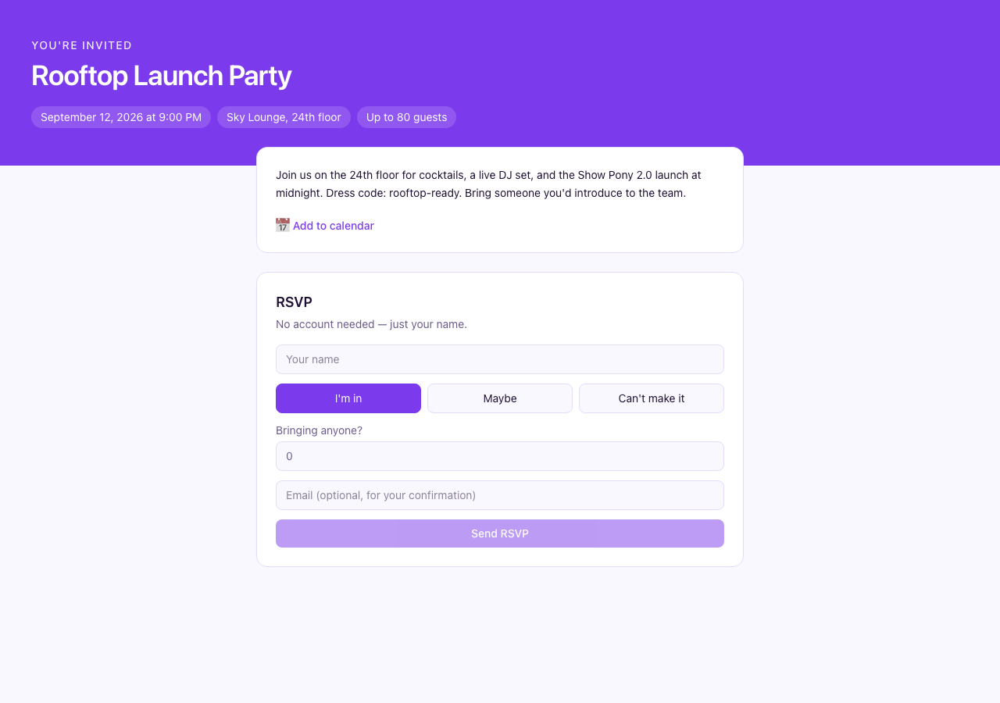
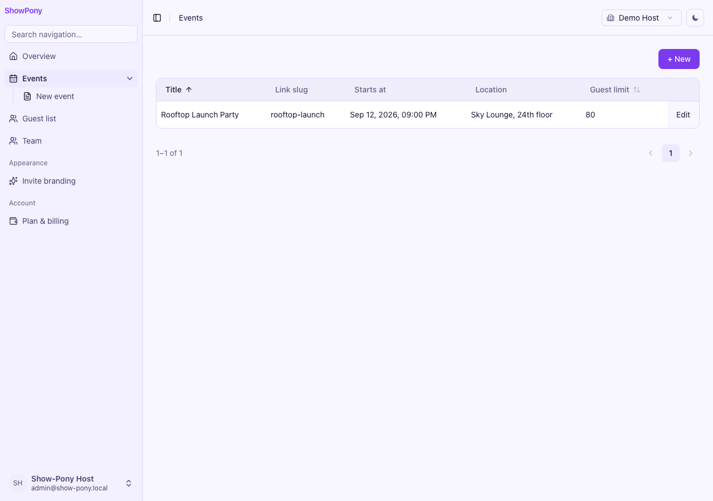
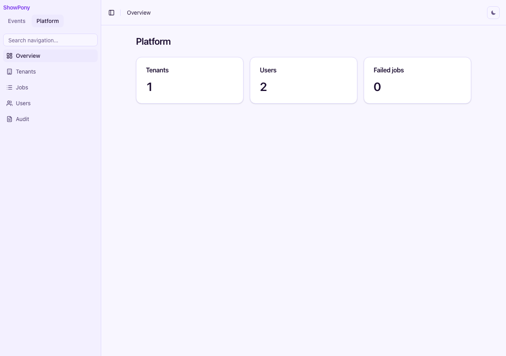

# Kumiko

> **AI-native backend builder.** Prompt your domain — get the full backend: schema, auth, audit, multi-tenant, realtime. TypeScript, your repo, your code.

[](./LICENSE) [](https://www.npmjs.com/package/@cosmicdrift/kumiko-framework) [](https://www.typescriptlang.org/) [](https://bun.sh)

<details>
<summary>Other things people say about Kumiko</summary>

> **"With Kumiko, everything is faster!"** <sup>\*faster than building it all from scratch again without Kumiko. Sample size: n=1 (the author).</sup>
>
> **"90% of developers say: Kumiko makes everything faster."** <sup>\*we asked 10.</sup>
>
> **"Enterprise-ready since day one."** <sup>\*day one hasn't arrived yet.</sup>
>
> **"Battle-tested in production."** <sup>\*the production of demo samples.</sup>
>
> **"Multi-tenant out of the box."** <sup>\*box not included.</sup>
>
> **"Zero-config."** <sup>\*after the initial 47-step setup.</sup>
>
> **"Realtime with <1ms latency."** <sup>\*on localhost, Wi-Fi off, exactly one tenant named "test".</sup>
>
> **"Scales to millions of users."** <sup>\*theoretically, provided Postgres, Redis, Meilisearch, and your wallet all cooperate.</sup>
>
> **"Type-safe down to the last line."** <sup>\*`any` is also a type.</sup>
>
> **"Kumiko — because framework frameworks need a framework too."**

</details>

---

## See it in action

[Show Pony](https://show-pony.kumiko.rocks) — a multi-tenant RSVP app built entirely on Kumiko.
Tutorial: [docs.kumiko.rocks/en/show-pony](https://docs.kumiko.rocks/en/show-pony/) · Source: [show-pony](https://github.com/CosmicDriftGameStudio/show-pony)

| Public invite (no account) | Host dashboard (schema-driven) | Platform ops (multi-tenant) |
|:---:|:---:|:---:|
|  |  |  |

---

## What it does

You write:

```typescript
const taskEntity = createEntity({
  table: "read_tasks",
  fields: {
    title: createTextField({ required: true }),
    status: createTextField({ sortable: true }),
    isArchived: createBooleanField({ default: false }),
  },
  softDelete: true,
});

export const taskFeature = defineFeature("tasks", (r) => {
  r.crud("task", taskEntity, {
    write: { access: { roles: ["Admin", "User"] } },
    read: { access: { openToAll: true } },
  });
});
```

You get, for free:

- **Multi-tenant scoping** — every entity is tenant-scoped by default
- **Audit trail** — every write appends to the event log; time-travel queries work
- **Auth + sessions** — email/password, JWT, role-based access
- **Bundled features** — auth, delivery, files, billing, DSGVO hooks, jobs, and more (`bun create kumiko-app` picks what you need)
- **Realtime updates** — SSE via async event-dispatcher
- **CRUD UI** — schema-driven forms and lists (`r.screen`) with override paths
- **Type-safe everywhere** — no `any`, no magic strings

## Quickstart

### New app (recommended)

```bash
bun create kumiko-app my-app
cd my-app
cp .env.example .env   # set JWT_SECRET + KUMIKO_SECRETS_MASTER_KEY_V1
bun install
bun run boot
```

The interactive picker wires bundled features (auth, tenant, files, notifications, …) and resolves hard dependencies for you.

Add a domain feature later:

```bash
kumiko add feature product-catalog
```

### Framework repo (contributors)

**Prerequisites:** [Bun](https://bun.sh/) ≥ 1.2, [Docker](https://www.docker.com/) (PostgreSQL + Redis)

```bash
git clone git@github.com:cosmicdriftgamestudio/kumiko-framework.git
cd kumiko-framework
bun install
bun kumiko dev      # Postgres :15432, Redis :16379
bun kumiko check    # Biome + TypeScript + tests + guards
```

```bash
bun kumiko          # interactive CLI
bun kumiko test     # unit tests
bun kumiko test integration
bun kumiko test e2e
bun kumiko test all
```

Explore a recipe hands-on:

```bash
cd samples/recipes/basic-entity
bun test
```

## Why use this

- **Built for B2B SaaS / internal tools** — multi-tenant + audit are first-class, not afterthoughts
- **Postgres-native** — Bun.SQL + EntityTableMeta, no ORM. One database, one source of truth
- **AI-builder ready** — config-driven, every `r.*` call is patchable by AI tools
- **DACH/EU-ready** — self-host on Hetzner / k8s / bare-metal. BYO LLM (Anthropic, OpenAI, Ollama, vLLM)

## Architecture

| Layer | Tech |
|-------|------|
| Runtime | Bun |
| API | Hono |
| DB | Postgres via Bun.SQL (EntityTableMeta + SQL migrations) |
| Auth | jose (JWT) |
| Search | Meilisearch |
| UI | React + Expo (Web + Mobile) |
| Realtime | SSE via Redis Pub/Sub |
| Async side-effects | Event-dispatcher (search index, SSE broadcast, projections) |
| Tests | bun:test |

Pipeline flow:

```
HTTP Request
  → JWT Auth (Hono middleware)
  → Dispatcher
    → Zod schema validation
    → Access check (entity-level roles)
    → Field-level write check
    → Validation hooks
    → Handler (event append + projection write, one TX)
    → Feature postSave hooks (same TX)
  → Response (with field-level read filtering)

After commit (async, eventually consistent):
  → Event-dispatcher drains kumiko_events
    → Meilisearch index update
    → SSE broadcast (Redis Pub/Sub)
    → r.multiStreamProjection consumers
```

The event log IS the audit trail — every write appends to `kumiko_events`
inside the handler transaction. Search and realtime follow via the dispatcher,
not synchronous lifecycle hooks.

## Live apps

| App | What it shows | Links |
|-----|---------------|-------|
| **Show Pony** | Tutorial app: multi-tenant RSVP, anonymous public writes, schema-driven host UI, billing hooks | [Live](https://show-pony.kumiko.rocks) · [Tutorial](https://docs.kumiko.rocks/en/show-pony/) · [Source](https://github.com/CosmicDriftGameStudio/show-pony) |
| **publicstatus** | Production statuspage clone on Hetzner | [Live](https://publicstatus.eu) · [Source](https://github.com/cosmicdriftgamestudio/publicstatus) |

## Samples

Tested, runnable examples per feature. Two buckets — see [samples/README.md](samples/README.md) for the full index:

- [`samples/recipes/`](samples/recipes/) — one concept = one feature definition + one test
- [`samples/apps/`](samples/apps/) — full-stack demos with dev-server + browser client

## Documentation

Full docs: [docs.kumiko.rocks](https://docs.kumiko.rocks).

## Status

Pre-1.0 — actively developed. APIs may change between minor versions until 1.0. Breaking-change policy and migration guides documented per release in [CHANGELOG.md](./CHANGELOG.md).

Used in production at [publicstatus.eu](https://publicstatus.eu) and [show-pony.kumiko.rocks](https://show-pony.kumiko.rocks).

## Join in

Kumiko is pre-1.0 and moving fast — help is welcome even if you're not a framework hacker.

**Good ways to start:**

- Walk through the [Show Pony tutorial](https://docs.kumiko.rocks/en/show-pony/) and open an issue if something confuses you — that's a docs fix.
- Pick a [recipe](samples/recipes/) close to your use case; a failing or missing recipe is a real bug.
- Docs, i18n (de/en), and screenshot drift in samples are always fair game.

**Before a bigger PR:** skim [CONTRIBUTING.md](./CONTRIBUTING.md) and open an issue for new features — saves you building something we're already shipping.

**Questions?** [GitHub Issues](https://github.com/CosmicDriftGameStudio/kumiko-framework/issues) or marc@cosmicdriftgamestudio.com.

Every merged PR needs tests where they make sense; every new framework feature needs a recipe. By contributing, you agree your contributions are licensed under the same BUSL-1.1 terms — see [LICENSE](./LICENSE).

## License

Business Source License 1.1 (BUSL-1.1) → Apache License 2.0 on **2030-05-05**.

You may use Kumiko in production for any purpose, **except** providing a platform or service to third parties that allows them to host, deploy, or run their own applications built with Kumiko. This includes managed hosting, SaaS platforms, PaaS, developer platforms, and any multi-tenant managed offering.

Code from any release automatically becomes Apache-2.0 four years after publication.

For commercial licensing or alternative arrangements: marc@cosmicdriftgamestudio.com.

Details: [LICENSE](./LICENSE).

## Hosted platform

Don't want to self-host? [kumiko.rocks](https://kumiko.rocks) is the hosted version with AI-builder, designer, and managed hosting.

---

© 2026 Marc Frost — Cosmic Drift Game Studio.
