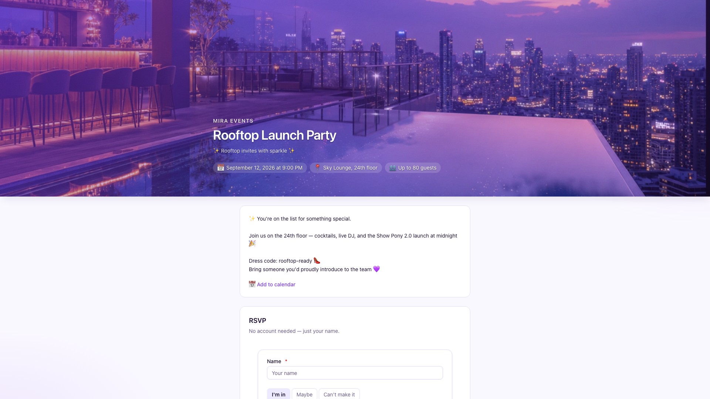
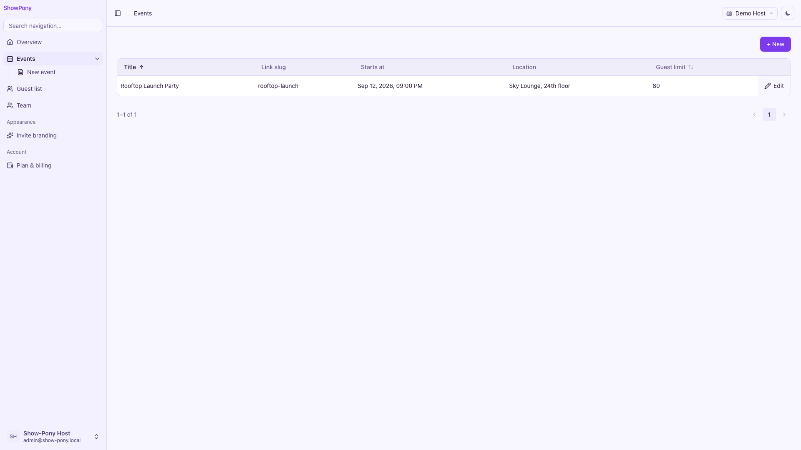
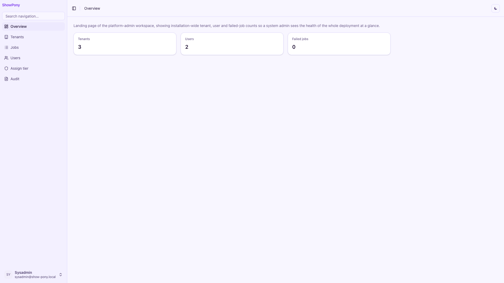

# Kumiko

> An AI-native backend builder. You describe your domain and get the backend for it: schema, auth, audit log, multi-tenancy and realtime updates, as TypeScript code in your own repo.

[](https://github.com/CosmicDriftGameStudio/kumiko-framework/actions/workflows/ci.yml) [](https://github.com/CosmicDriftGameStudio/kumiko-framework/actions/workflows/ci.yml) [](./LICENSE) [](https://www.npmjs.com/package/@cosmicdrift/kumiko-framework) [](https://www.typescriptlang.org/) [](https://bun.sh)

<details>
<summary>Other things people say about Kumiko</summary>

> **"With Kumiko, everything is faster!"** <sup>\*faster than building it all from scratch again without Kumiko. Sample size: n=1 (the author).</sup>
>
> **"90% of developers say: Kumiko makes everything faster."** <sup>\*we asked 10.</sup>
>
> **"Enterprise-ready since day one."** <sup>\*day one hasn't arrived yet.</sup>
>
> **"Battle-tested in production."** <sup>\*the production of demo samples.</sup>
>
> **"Multi-tenant out of the box."** <sup>\*box not included.</sup>
>
> **"Zero-config."** <sup>\*after the initial 47-step setup.</sup>
>
> **"Realtime with <1ms latency."** <sup>\*on localhost, Wi-Fi off, exactly one tenant named "test".</sup>
>
> **"Scales to millions of users."** <sup>\*theoretically, provided Postgres, Redis, Meilisearch, and your wallet all cooperate.</sup>
>
> **"Type-safe down to the last line."** <sup>\*`any` is also a type.</sup>
>
> **"Kumiko — because framework frameworks need a framework too."**

</details>

## See it in action

[Show Pony](https://show-pony.kumiko.rocks) is a multi-tenant RSVP app built entirely on Kumiko.
Tutorial: [docs.kumiko.rocks/en/show-pony](https://docs.kumiko.rocks/en/show-pony/) · Source: [show-pony](https://github.com/CosmicDriftGameStudio/show-pony)

| Public invite (no account) | Host dashboard (schema-driven) | Platform ops (multi-tenant) |
|:---:|:---:|:---:|
|  |  |  |

These are the same screenshots [docs.kumiko.rocks](https://docs.kumiko.rocks/en/show-pony/) uses, taken by the Playwright matrix in show-pony.
After UI changes, run `cd show-pony && bun run screenshots`, copy the result to `kumiko-platform/apps/docs/public/screenshots/show-pony/`, then run `bun run sync:readme-screenshots` in this repo.

## What it does

You write:

```typescript
const taskEntity = createEntity({
  table: "read_tasks",
  fields: {
    title: createTextField({ required: true }),
    status: createTextField({ sortable: true }),
    isArchived: createBooleanField({ default: false }),
  },
  softDelete: true,
});

export const taskFeature = defineFeature("tasks", (r) => {
  r.crud("task", taskEntity, {
    write: { access: { roles: ["Admin", "User"] } },
    read: { access: { openToAll: { reason: "any signed-in user may list and view tasks" } } },
  });
});
```

You get, for free:

- Tenant scoping: every entity is tenant-scoped by default.
- An audit trail: every write appends to the event log, and you can run time-travel queries against it.
- Auth and sessions with email/password, JWT and role-based access.
- Bundled features for auth, delivery, files, billing, DSGVO hooks, jobs and more. `bun create kumiko-app` lets you pick the ones you need.
- Realtime updates over SSE, delivered by the async event-dispatcher.
- A schema-driven CRUD UI (forms and lists via `r.screen`) that you can override where needed.
- Strict types throughout, without `any` or magic strings.

## Quickstart

### New app (recommended)

```bash
bun create kumiko-app my-app
cd my-app
cp .env.example .env   # set JWT_SECRET + KUMIKO_SECRETS_MASTER_KEY_V1
bun install
bun dev
```

The interactive picker wires bundled features (auth, tenant, files, notifications, …) and resolves hard dependencies for you.

Add a domain feature later:

```bash
kumiko add feature product-catalog
```

### Framework repo (contributors)

You need [Bun](https://bun.sh/) ≥ 1.4.0 and [Docker](https://www.docker.com/) for PostgreSQL, Redis, Meilisearch and MinIO.

```bash
git clone git@github.com:cosmicdriftgamestudio/kumiko-framework.git
cd kumiko-framework
bun install
bun kumiko dev      # Postgres :15432, Redis :16379, Meilisearch :17700, MinIO :19000
bun kumiko check    # Biome + TypeScript + tests + guards
```

```bash
bun kumiko          # interactive CLI
bun kumiko test     # unit tests
bun kumiko test integration
bun kumiko test e2e
bun kumiko test all
```

To try a recipe:

```bash
cd samples/recipes/basic-entity
bun test
```

## Why use this

Kumiko is built for B2B SaaS and internal tools, so multi-tenancy and the audit trail are part of the core.

It talks to Postgres directly through Bun.SQL and EntityTableMeta, without an ORM, and keeps one database as the single source of truth.

Features are config-driven, which means AI tools can patch every `r.*` call.

For DACH/EU setups you can self-host on Hetzner, Kubernetes or bare metal and bring your own LLM (Anthropic, OpenAI, Ollama, vLLM).

## Architecture

| Layer | Tech |
|-------|------|
| Runtime | Bun |
| API | Hono |
| DB | Postgres via Bun.SQL (EntityTableMeta + SQL migrations) |
| Auth | jose (JWT) |
| Search | Meilisearch |
| UI | React + Expo (Web + Mobile) |
| Realtime | SSE via Redis Pub/Sub |
| Async side-effects | Event-dispatcher (search index, SSE broadcast, projections) |
| Tests | bun:test |

Pipeline flow:

```
HTTP Request
  → JWT Auth (Hono middleware)
  → Dispatcher
    → Zod schema validation
    → Access check (entity-level roles)
    → Field-level write check
    → Validation hooks
    → Handler (event append + projection write, one TX)
    → Feature postSave hooks (same TX)
  → Response (with field-level read filtering)

After commit (async, eventually consistent):
  → Event-dispatcher drains kumiko_events
    → Meilisearch index update
    → SSE broadcast (Redis Pub/Sub)
    → r.multiStreamProjection consumers
```

The event log is the audit trail: every write appends to `kumiko_events`
inside the handler transaction. Search indexing and realtime updates run
after commit through the dispatcher, outside the request's transaction.

## Live apps

| App | What it shows | Links |
|-----|---------------|-------|
| **Show Pony** | Tutorial app: multi-tenant RSVP, anonymous public writes, schema-driven host UI, billing hooks | [Live](https://show-pony.kumiko.rocks) · [Tutorial](https://docs.kumiko.rocks/en/show-pony/) · [Source](https://github.com/CosmicDriftGameStudio/show-pony) |
| **publicstatus** | Production statuspage clone on Hetzner | [Live](https://publicstatus.eu) · [Source](https://github.com/cosmicdriftgamestudio/publicstatus) |

## Samples

Every feature has a tested, runnable example. [samples/README.md](samples/README.md) has the full index; the examples live in two folders:

- [`samples/recipes/`](samples/recipes/) holds one feature definition and one test per concept.
- [`samples/apps/`](samples/apps/) holds full-stack demos with a dev server and a browser client.

## Documentation

Full docs: [docs.kumiko.rocks](https://docs.kumiko.rocks).

## Status

Kumiko is pre-1.0 and under active development. APIs may change between minor versions until 1.0 ([stability policy](docs/reference/stability-policy.md)). Every breaking change ships with a migration note in its package changelog, indexed in [CHANGELOG.md](./CHANGELOG.md). In an app, `bunx kumiko-upgrade` lists what changed since your installed version and `--apply` runs the codemods.

Used in production at [publicstatus.eu](https://publicstatus.eu) and [show-pony.kumiko.rocks](https://show-pony.kumiko.rocks).

## Join in

Kumiko is pre-1.0 and changes quickly. Help is welcome even if you're not a framework hacker.

Good ways to start:

- Walk through the [Show Pony tutorial](https://docs.kumiko.rocks/en/show-pony/) and open an issue if something confuses you. That counts as a docs fix.
- Pick a [recipe](samples/recipes/) close to your use case. A failing or missing recipe is a real bug.
- Docs, i18n (de/en) and screenshot drift in samples are always fair game.

Before a bigger PR, skim [CONTRIBUTING.md](./CONTRIBUTING.md) and open an issue for new features, so you don't build something we're already shipping.

Questions go to [GitHub Issues](https://github.com/CosmicDriftGameStudio/kumiko-framework/issues) or marc@cosmicdriftgamestudio.com.

Every merged PR needs tests where they make sense; every new framework feature needs a recipe. By contributing, you agree your contributions are licensed under the same BUSL-1.1 terms (see [LICENSE](./LICENSE)).

## License

Kumiko is licensed under the Business Source License 1.1 (BUSL-1.1) and converts to the Apache License 2.0 on 2030-05-05.

You may use Kumiko in production for any purpose, **except** providing a platform or service to third parties that allows them to host, deploy, or run their own applications built with Kumiko. This includes managed hosting, SaaS platforms, PaaS, developer platforms, and any multi-tenant managed offering.

Code from any release automatically becomes Apache-2.0 four years after publication.

For commercial licensing or alternative arrangements: marc@cosmicdriftgamestudio.com.

Details: [LICENSE](./LICENSE).

## Hosted platform

Don't want to self-host? [kumiko.rocks](https://kumiko.rocks) is the hosted version with AI-builder, designer, and managed hosting.

© 2026 Marc Frost, Cosmic Drift Game Studio.
